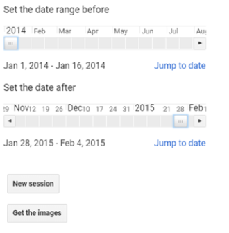
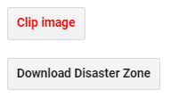

## User Manual 

The Change Detection for Emergency Management is a tool that uses Google Earth Engine as a front-end, while the back-end code is written in JavaScript. The tool takes advantage of Landsat 8 imagery, with the algorithms that are set to analyse the land cover changes - flooded areas, forest fires and deforestation.

First, the user is required to set the location of the area, using points, lines or polygons.

*Fig. 1 - Draw tools*

Second, once the area on the map is selected, the user is required to select the before and after dates, which will trigger the tool to download the Landsat 8 images from the database. Once dates are selected, by clicking the “Get the Images button”, the tool will download the 2 images for the selected location.

*Fig. 2 - Date Slider*

In case images are not available in the database, the alert message will pop up instructing the user to change either before or after date. The user required to look for the available date by selecting the pop-up calendar or scrolling the dates line. In addition, users are restricted to perform the analysis without selecting the date.

*Fig. 3 - Warning Message*

Third, The available Landsat 8 images will appear on the map in the study area. The next step would be to select the type of emergency situation the user would like to see. The available emergency situations are deforestation, flooding and forest fires. The analyzed images will be presented on the screen indicating the emergency impact.

*Fig. 4 - Emergency Options*

Fourth, The user can select the map layers that would appear in the study area. Each emergency situation has different layers. Users can also change the transparency on the satellite image, scrolling next to the layer name.

*Fig. 5 - Selected Layers*

Finally, the user can cut the affected area or the damaged area then download just the intrested area and use it on his own database and do whatever analysis he wants on it. This is very important because the user will download just what he wants from the results to save the time consuming by downloading the whole big images and analysing them.

*Fig. 5 - Clip & Download the results*

[Go Back](README.md)
