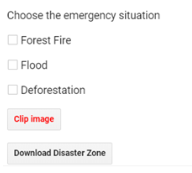

## User Manual 
Navigate to the study area using the bookmarks, then follow the following steps:

1- The user is required to set the location of the area using points, lines, or polygons tools from the Drawing Toolbar. 

2- Select the dates before and after the event from the Date Dlider. Then, click on the "Get the Images" button to tell GEE to find the appropriate images on the selected dates.

* In case images are not available in the database, the alert message will pop-up to tell the user to change the date. 

4- select the type of emergency: deforestation, flood, or forest fires.

*The user can select the map layers that appear in the study area.

5- Cut the affected area, then download it, use it locally.

  
[Go Back](README.md)

